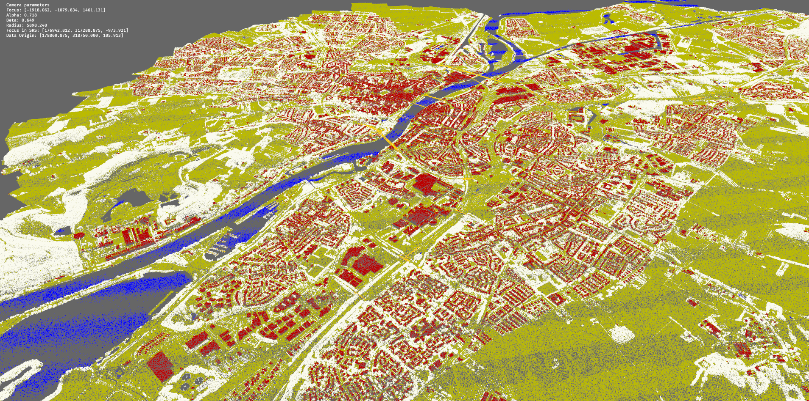

# Crux

**Point cloud data management research experiments.**

[](https://zenodo.org/doi/10.5281/zenodo.10822177)



## Quick Start

### Prepare data

Download some sample data from AHN with the `ahn.py` script.

```bash
python scripts/ahn.py --dataset AHN3 --filenames C_69AZ1
```

This will download the file `C_69AZ1.LAZ` into the `./data/AHN3` folder.

### Start server (Docker)

First bild the image using the following command.

```bash
# build image
docker build --tag "crux_test" .
# run interactive
docker run -it --rm --env-file .env -e PORT=3000 -p 3000:3000 -v ./data:/crux/data crux_test
# check status
curl -G '0.0.0.0:3000/status' | jq
```

This will spaw a single worker instance. To set up as distributed system with docker swarm see [./doc/swarm.md](./doc/swarm.md). 

### Load data

```bash
curl -G '0.0.0.0:3000/load' -d 'uris=./data/AHN3/C_69AZ1.LAZ'
```

### Query data

```bash
# query a random sample of the loaded data
curl -G '0.0.0.0:3000/points?p=0.001' --output test.arrow
# query by x, y, z and importance bounds
curl -G '0.0.0.0:3000/points?bounds=174000,315000,0,0,174060,315060,1000,1' --output test.arrow
```

## Citation

```bibtex
@article{teuscher2024datadistr,
  title={Random Data Distribution for Efficient Parallel Point Cloud Processing},
  author={Teuscher, Balthasar and Werner, Martin},
  journal={AGILE: GIScience Series},
  year={2024},
}
```

## License

Licensed under either of

 * Apache License, Version 2.0 ([LICENSE-APACHE](LICENSE-APACHE) or http://www.apache.org/licenses/LICENSE-2.0)
 * MIT license ([LICENSE-MIT](LICENSE-MIT) or http://opensource.org/licenses/MIT)

at your option.
